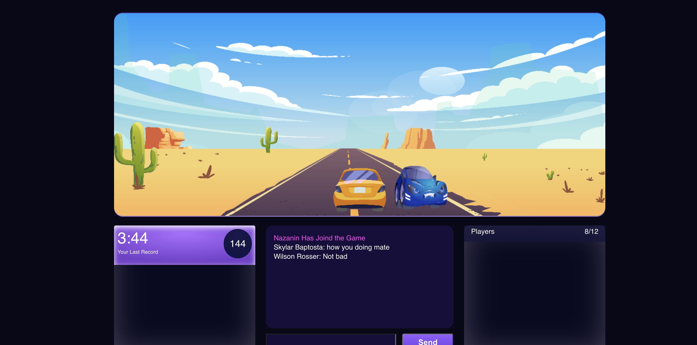

# Wrong Way Client

### Preview

[https://zingy-licorice-d6e000.netlify.app/](https://zingy-licorice-d6e000.netlify.app/)

### Start Game

1. Click Start New Game
2. Move your car using keyboard [Left, Right] to avoid collisions with an oncoming car.

#### Limitations

`Styles`, `smooth motion` and `socket` commands are not fully complete and may not be the same as Figma.

#### Links

1. [FigmaUI](https://www.figma.com/file/4Nab0Vn7YR3znsx7Oulfv8/Assessment?node-id=3604%3A424142)
2. [Socket Connection URL(socket.io)](wss://wrongway-racer-api.spls.ae/)
3. [SplashSoftware](https://spls.ae/assessment/wrongwayracer)